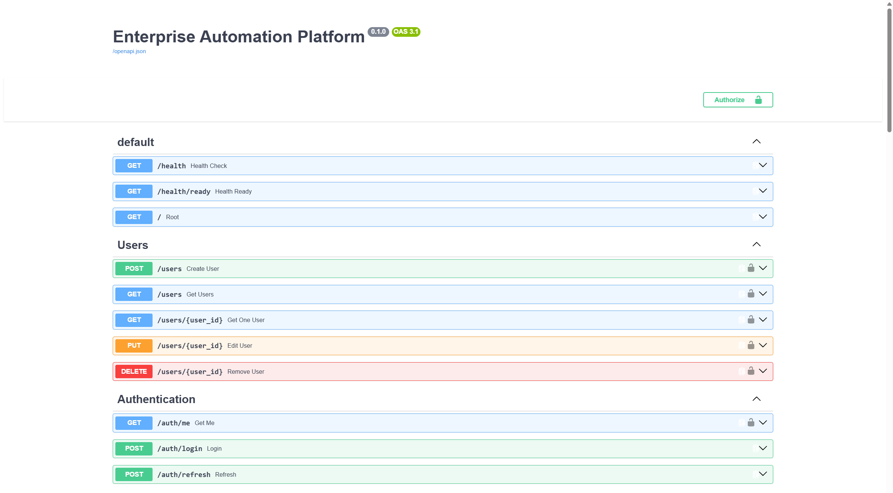

# Enterprise Automation Platform

[](https://www.python.org/downloads/)
[](https://fastapi.tiangolo.com)
[](https://www.postgresql.org)
[](LICENSE)

Una plataforma integral de automatización empresarial construida con FastAPI, diseñada para gestionar workflows, tickets, usuarios, roles y auditoría de sistemas.

## Características

- Gestión de usuarios y roles con control de acceso basado en roles (RBAC)
- Sistema de tickets de soporte con estados y prioridades
- Motor de workflows para automatización de procesos
- Auditoría completa de acciones del sistema
- Integración con servicios de IA local usando Ollama and Gemma 3 4B para automatización inteligente
- API RESTful con documentación interactiva
- Arquitectura modular y escalable

## Arquitectura

### Stack Tecnológico

| Componente | Tecnología | Versión |
|------------|------------|---------|
| Backend | FastAPI | 0.138.0 |
| Base de Datos | PostgreSQL | 16 |
| Cache | Redis | 7 |
| ORM | SQLAlchemy | 2.0.51 |
| Validación | Pydantic | 2.13.4 |
| Migraciones | Alembic | 1.18.4 |
| Autenticación | JWT (python-jose) | 3.5.0 |
| Servidor ASGI | Uvicorn | 0.49.0 |
| Testing | pytest | 8.3.0 |
| IA | Ollama | Gemma 3 4B |

### Estructura del Proyecto

```
enterprise-automation-platform/
├── backend/
│   ├── app/
│   │   ├── ai/              # Módulo de IA y automatización inteligente
│   │   ├── api/             # Endpoints de API
│   │   ├── auth/            # Autenticación y autorización
│   │   ├── audit/           # Sistema de auditoría
│   │   ├── clients/         # Gestión de clientes
│   │   ├── common/          # Utilidades comunes
│   │   ├── core/            # Configuración central
│   │   ├── database/        # Configuración de base de datos
│   │   ├── notifications/   # Sistema de notificaciones
│   │   ├── roles/           # Gestión de roles y permisos
│   │   ├── security/        # Seguridad y encriptación
│   │   ├── tickets/         # Sistema de tickets
│   │   ├── users/           # Gestión de usuarios
│   │   ├── workflow_engine/ # Motor de workflows
│   │   └── workflows/       # Gestión de workflows
│   ├── alembic/             # Migraciones de base de datos
│   ├── tests/               # Tests unitarios
│   ├── requirements.txt     # Dependencias de Python
│   └── .env                 # Variables de entorno (no versionado)
├── docs/                    # Documentación (pendiente)
├── docker-compose.yml       # Orquestación de contenedores
└── .gitignore              # Archivos ignorados por git
```

## Configuración e Instalación

### Prerrequisitos

- Docker y Docker Compose
- Python 3.13+
- Git

### Variables de Entorno

Crear un archivo `.env` en el directorio `backend/` con las siguientes variables:

```env
APP_NAME=Enterprise Automation Platform
ENVIRONMENT=development

# PostgreSQL
POSTGRES_DB
POSTGRES_USER
POSTGRES_PASSWORD
POSTGRES_HOST
POSTGRES_PORT

# Redis
REDIS_HOST=localhost
REDIS_PORT=6379

# JWT
JWT_SECRET_KEY
JWT_ALGORITHM

# Tokens
ACCESS_TOKEN_EXPIRE_MINUTES
REFRESH_TOKEN_EXPIRE_DAYS

# AI/OLLAMA
OLLAMA_URL=http://localhost:11434/api/generate
OLLAMA_MODEL=gemma3:4b
```

### Iniciar con Docker

1. Clonar el repositorio:
```bash
git clone <repository-url>
cd enterprise-automation-platform
```

2. Iniciar los servicios:
```bash
docker-compose up -d
```

3. Verificar que los servicios estén corriendo:
```bash
docker-compose ps
```

### Instalación Local

1. Crear entorno virtual:
```bash
cd backend
python -m venv venv
source venv/bin/activate  # En Windows: venv\Scripts\activate
```

2. Instalar dependencias:
```bash
pip install -r requirements.txt
```

3. Configurar base de datos:
```bash
alembic upgrade head
```

4. Iniciar el servidor:
```bash
uvicorn app.main:app --reload --host 0.0.0.0 --port 8000
```

## API Endpoints

### Authentication

- `POST /auth/login` - Inicio de sesión (OAuth2)
- `GET /auth/me` - Obtener usuario actual (requiere autenticación)

### Users

- `POST /users/` - Crear usuario (requiere autenticación)
- `GET /users/` - Listar usuarios (requiere autenticación)
- `GET /users/{user_id}` - Obtener usuario por ID (requiere autenticación)
- `PUT /users/{user_id}` - Actualizar usuario (requiere autenticación)
- `DELETE /users/{user_id}` - Eliminar usuario (requiere autenticación)

### Tickets

- `POST /tickets/` - Crear ticket (requiere autenticación)
- `GET /tickets/` - Listar tickets (requiere autenticación)
- `GET /tickets/{ticket_id}` - Obtener ticket por ID (requiere autenticación)
- `PUT /tickets/{ticket_id}` - Actualizar ticket (requiere autenticación)
- `DELETE /tickets/{ticket_id}` - Eliminar ticket (requiere autenticación)

### Workflows

- `POST /workflows/` - Crear workflow (requiereRol: Admin)
- `GET /workflows/` - Listar workflows (requiereRol: Admin)
- `GET /workflows/{workflow_id}` - Obtener workflow por ID (requiereRol: Admin)
- `PUT /workflows/{workflow_id}` - Actualizar workflow (requiereRol: Admin)
- `DELETE /workflows/{workflow_id}` - Eliminar workflow (requiereRol: Admin)

### System

- `GET /` - Root endpoint
- `GET /health` - Health check

### Documentación Interactiva

Una vez iniciado el servidor, accede a:
- **Swagger UI**: http://localhost:8000/docs
- **ReDoc**: http://localhost:8000/redoc

## 🗄️ Base de Datos

### Migraciones

Crear nueva migración:
```bash
alembic revision --autogenerate -m "description"
```

Aplicar migraciones:
```bash
alembic upgrade head
```

Revertir migración:
```bash
alembic downgrade -1
```

## Seguridad

- Autenticación basada en JWT con tokens de acceso y refresh
- Encriptación de contraseñas con bcrypt
- Sistema de roles y permisos (RBAC)
- Auditoría completa de acciones del sistema
- Variables de entorno para datos sensibles
- Dependencias de autenticación en endpoints protegidos
- Control de acceso basado en roles para operaciones críticas


## Módulos Principales

### Auth
- Registro y autenticación de usuarios
- Gestión de tokens JWT (access y refresh)
- Validación de credenciales

### Users
- CRUD de usuarios
- Gestión de perfiles
- Asignación de roles

### Roles
- Definición de roles y permisos
- Asignación de roles a usuarios
- Control de acceso basado en roles (RBAC)

### Tickets
- Sistema de tickets de soporte
- Gestión de estados y prioridades
- Comentarios en tickets

### Workflows
- Definición de workflows
- Ejecución de procesos automatizados
- Motor de workflow engine

### Audit
- Registro de acciones del sistema
- Trazabilidad de cambios
- Logs de seguridad

### Clients
- Gestión de clientes empresariales
- Información de contacto
- Historial de interacciones

### AI
- Integración con servicios de IA
- Automatización inteligente
- Análisis y clasificación inteligente de tickets

## Desarrollo

### Código de Estilo

El proyecto sigue las convenciones de PEP 8 y utiliza:
- Type hints para mejor documentación del código
- Pydantic para validación de datos
- SQLAlchemy ORM para acceso a base de datos
- FastAPI para la API REST

### Testing

Ejecutar tests:
```bash
cd backend
pytest
```

Ejecutar tests con cobertura:
```bash
pytest --cov=app --cov-report=html
```

### Branching Strategy

- `master` - Rama principal de producción
- `develop` - Rama de desarrollo
- `feature/*` - Nuevas funcionalidades
- `bugfix/*` - Correcciones de bugs

## Screenshots

### Swagger UI



### Dashboard


*Nota: Los screenshots se agregarán en futuras versiones.*


