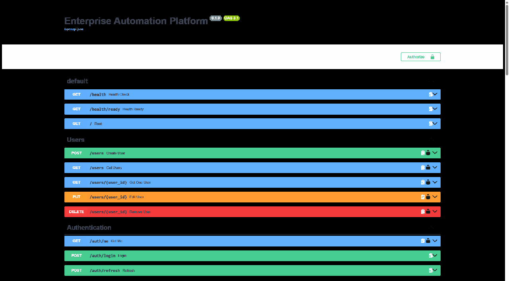
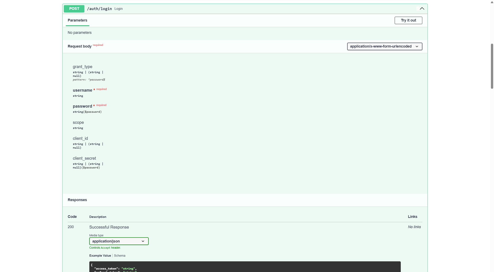
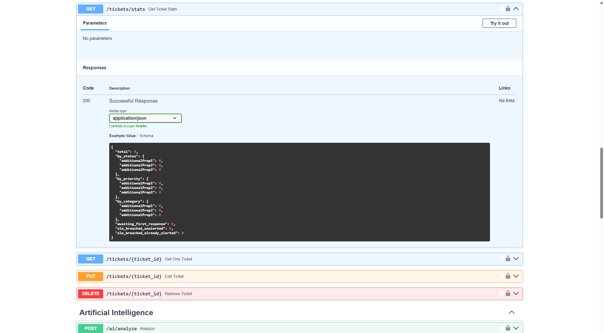
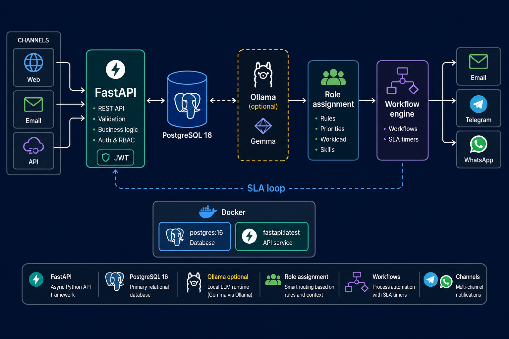
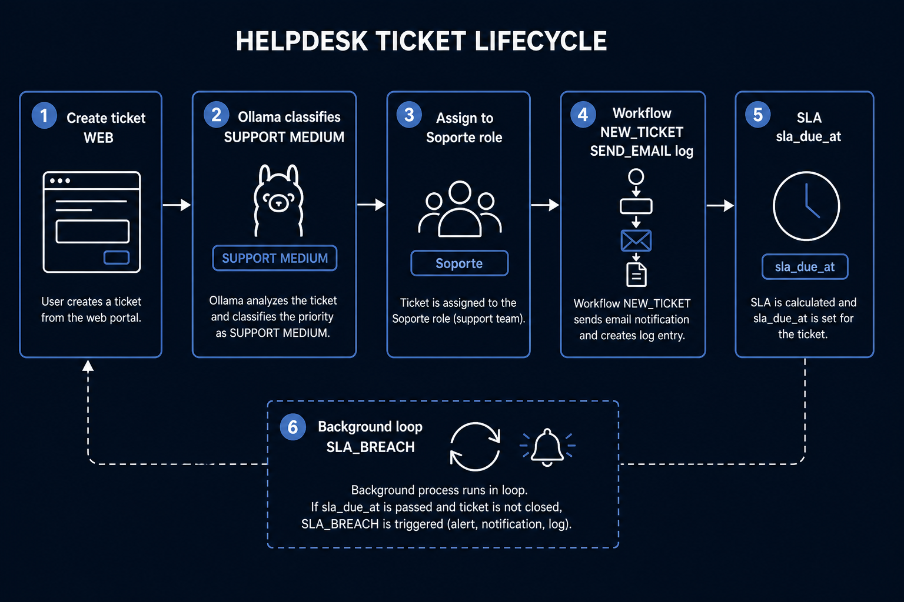
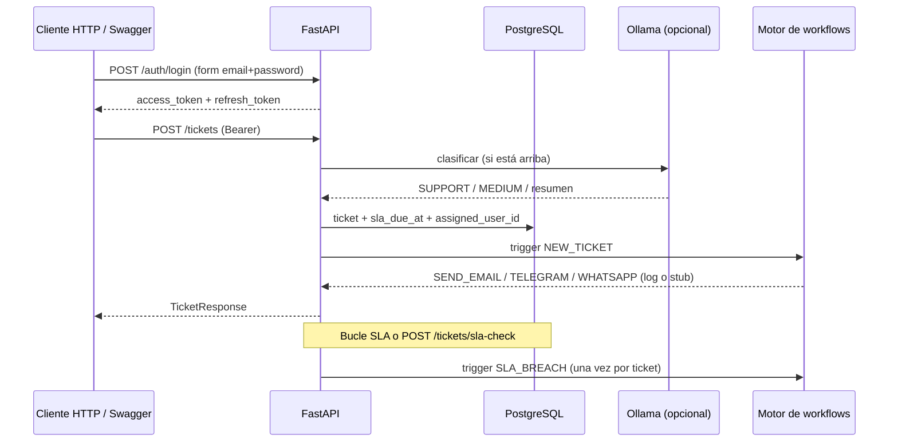

# Enterprise Automation Platform

API de helpdesk y automatización **sin frontend**. Hoy se usa desde [Swagger UI](http://127.0.0.1:8000/docs) o cualquier cliente HTTP.

[](https://www.python.org/downloads/)
[](https://fastapi.tiangolo.com)
[](https://www.postgresql.org)
[](https://docs.docker.com/compose/)

**Qué hay ahora:** tickets con categoría/prioridad controladas (`SUPPORT`, `MEDIUM`, `HIGH`, …), clasificación opcional con Ollama, asignación por rol (`Facturación` / `Soporte` / `Ventas`), workflows con filtro JSON, SLA de primera respuesta (job manual + bucle), métricas `GET /tickets/stats`, JWT access + refresh, y la API en Docker junto a Postgres.

**Qué no hay:** interfaz de usuario propia, dashboard web, Redis en uso, n8n, WhatsApp Cloud API (el canal es un `print`), correo SMTP real, ni agente IA más allá de clasificar al crear el ticket.

---

## Cómo se ve (ahora mismo)

No hay pantallas de producto. La “aplicación” es la documentación interactiva de FastAPI.

### Recorrido (capturas + Swagger en vivo)

No hay frontend que grabar como “app de escritorio”. El recorrido **en vídeo** es usar Swagger: http://127.0.0.1:8000/docs → **Try it out** (login → Authorize → tickets). En Windows puedes grabar esa pestaña con **Win + G**.

Las tres capturas siguientes son ese mismo recorrido, en orden (también como GIF):



| Qué | URL |
|-----|-----|
| Swagger (probar la API) | http://127.0.0.1:8000/docs |
| ReDoc (solo lectura) | http://127.0.0.1:8000/redoc |
| Health | http://127.0.0.1:8000/health |

Para grabar un vídeo tuyo: Windows + G (Xbox Game Bar) con `/docs` abierto, o un Loom. No hay MP4 de producto porque no hay UI.

### Swagger UI — catálogo de endpoints


### Login (OAuth2 form)

`POST /auth/login` usa **formulario**, no JSON. El campo `username` es el **email**. Respuesta: `access_token` y `refresh_token`.



1. Ejecuta **login** y copia `access_token`.
2. **Authorize** (candado) → pega el token (sin la palabra `Bearer`).
3. `GET /auth/me` no incluye `hashed_password`.
4. `POST /auth/refresh` con el refresh emite un par nuevo. Un refresh **no** vale como Bearer en `/tickets`.

### Métricas (el “dashboard” actual)

No hay pantalla de gráficos. El resumen es JSON: `GET /tickets/stats` (hace falta JWT).



Campos: `total`, `by_status`, `by_priority`, `by_category`, `awaiting_first_response`, `sla_breached_unalerted`, `sla_breached_already_alerted`.

### Arquitectura y ciclo del ticket







---

## Flujo real al crear un ticket

1. JWT de un usuario activo.
2. `client_id` existente.
3. Defaults `SUPPORT` / `MEDIUM` si Ollama falla; si responde, se **normalizan** alias en español a enums.
4. SLA en horas según prioridad (`CRITICAL` 1 h, `HIGH` 2 h, `MEDIUM` 8 h, `LOW` 24 h).
5. Asignación: `BILLING` → rol `Facturación`, `SUPPORT` → `Soporte`, `SALES` → `Ventas` (primer usuario activo con ese nombre de rol).
6. Workflows `ACTIVE` con `trigger == NEW_TICKET`. `configuration` vacío = siempre; JSON `{"priority":"CRITICAL"}` = solo si coincide.
7. Acciones: `SEND_EMAIL` (log), `SEND_TELEGRAM` / `SEND_WHATSAPP` (print/stub).
8. Primer comentario **público** rellena `first_response_at`.
9. SLA vencido + sin primera respuesta + `sla_alerted_at` vacío → `SLA_BREACH` (POST `/tickets/sla-check` o bucle si `SLA_CHECK_INTERVAL_SECONDS > 0`).

Rol de administración en código: nombre **`Administrador`** (el seed inglés `Administrator` es otro rol).

---

## Arranque

### Docker (API + Postgres)

Desde la **raíz** del repo. Variables de Postgres en `backend/.env` (Compose las inyecta; `POSTGRES_HOST` de la API se fuerza a `postgres`).

```powershell
docker compose up -d --build
```

- API: http://127.0.0.1:8000/docs  
- No dejes otro uvicorn en el puerto 8000.  
- Redis se levanta pero **la aplicación no lo usa**.  
- Ollama en el host no es `localhost` desde el contenedor (`host.docker.internal` si lo necesitas). Los tickets se crean igual sin IA.

### Local (venv)

```powershell
cd backend
.\venv\Scripts\Activate.ps1
pip install -r requirements.txt
alembic upgrade head
uvicorn app.main:app --reload --host 0.0.0.0 --port 8000
```

Postgres tiene que estar en marcha (`docker compose up -d postgres` basta).

---

## Variables (`backend/.env`)

No se versiona. Ejemplo de claves que `Settings` espera:

```env
APP_NAME=Enterprise Automation Platform
ENVIRONMENT=development

POSTGRES_DB=enterprise_db
POSTGRES_USER=postgres
POSTGRES_PASSWORD=tu_password
POSTGRES_HOST=localhost
POSTGRES_PORT=5432

REDIS_HOST=localhost
REDIS_PORT=6379

JWT_SECRET_KEY=cambia_esto
JWT_ALGORITHM=HS256
ACCESS_TOKEN_EXPIRE_MINUTES=30
REFRESH_TOKEN_EXPIRE_DAYS=7

OLLAMA_URL=http://127.0.0.1:11434/api/generate
OLLAMA_MODEL=gemma3:4b

CORS_ORIGINS=http://localhost:3000
SLA_CHECK_INTERVAL_SECONDS=0
```

`SLA_CHECK_INTERVAL_SECONDS=0` desactiva el bucle (recomendado en tests). En Docker, `15` o `60` para probar SLA automático.

---

## Endpoints (resumen)

| Área | Rutas | Auth |
|------|--------|------|
| Sistema | `GET /`, `/health`, `/health/ready` | Público |
| Auth | `POST /auth/login`, `POST /auth/refresh`, `GET /auth/me` | me/refresh según caso |
| Users | CRUD `/users` | JWT; altas/bajas admin |
| Roles | `GET /roles` | JWT |
| Clients | CRUD `/clients` | listar JWT; mutar admin |
| Tickets | CRUD, `GET /tickets/stats`, `POST /tickets/sla-check` | JWT; sla-check admin |
| Comentarios | `/tickets/{id}/comments` | JWT |
| Workflows | CRUD `/workflows` | Admin |
| Audit | `GET /audit` | Admin |
| IA | `POST /ai/analyze` | JWT |

Login: `username` = email, `Content-Type: application/x-www-form-urlencoded`.

---

## Estructura (relevante)

```
enterprise-automation-platform/
├── docker-compose.yml          # postgres, api, redis (redis sin uso)
├── docs/screenshots/           # capturas de esta versión
└── backend/
    ├── Dockerfile
    ├── entrypoint.sh           # alembic upgrade + uvicorn
    ├── alembic/
    ├── tests/
    └── app/
        ├── auth/               # login, refresh, /me
        ├── tickets/            # CRUD, stats, SLA, scheduler
        ├── workflows/          # CRUD + engine
        ├── assignment/         # asignación por categoría
        ├── ai/                 # Ollama + normalize
        ├── notifications/      # email log, telegram/whatsapp stub
        ├── security/           # JWT, bcrypt, RBAC por nombre
        └── ...
```

No existe `app/workflow_engine/`. El motor está en `app/workflows/engine.py`.

---

## Tests

Desde `backend` con el **venv** (no el Python del sistema):

```powershell
python -m pytest tests/test_security.py tests/test_auth.py -v
```

---

## Pendiente (producto)

WhatsApp Cloud API (Meta, de pago en producción), n8n, agente con herramientas, frontend/dashboard, SMTP real, cola Redis.
